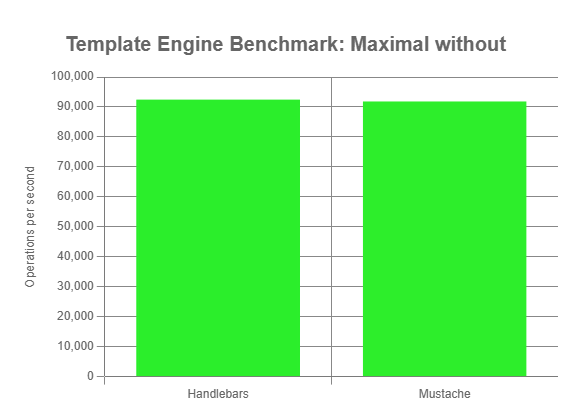
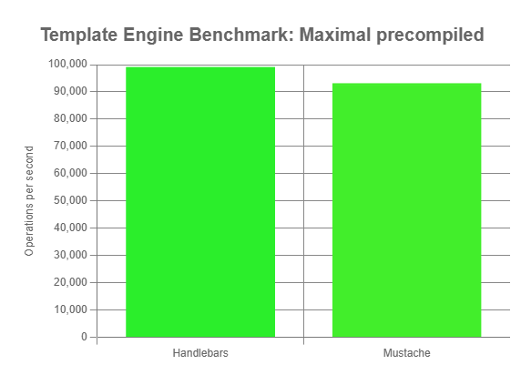

Templating Engines
==================

- [Mustache](https://github.com/janl/mustache.js) ⭐ 16k -- 2 years ago
- [Handlebars](https://github.com/handlebars-lang/handlebars.js/) ⭐ 18k -- 10 months ago
- [nunjucks](https://github.com/mozilla/nunjucks) ⭐ 9k -- 3 weeks ago
- [eta](https://github.com/eta-dev/eta) ⭐ 5k -- 11 months ago
- [doT](https://github.com/olado/doT) ⭐ 2k -- 5 years ago

Benchmarks with: [benny](https://github.com/caderek/benny)


## Run Benchmarks

```sh
npm install

# Run benchmarks
npm start

# See graphs
npm run serve
```


## Benchmark Results

See `benchmark/results`

### Mustache vs Handlebars Charts






## Precompile Handlebars

See [Load precompiled templates from Typescript](https://github.com/handlebars-lang/handlebars.js/issues/1528)

```sh
cd src
npx handlebars minimal-precompiled.handlebars -f minimal-precompiled-hbs.js -c handlebars
npx handlebars maximal-precompiled.handlebars -f maximal-precompiled-hbs.js -c handlebars

# and then we changed
var Handlebars = require("handlebars");
# into
import Handlebars from "handlebars";
# 😀
```
